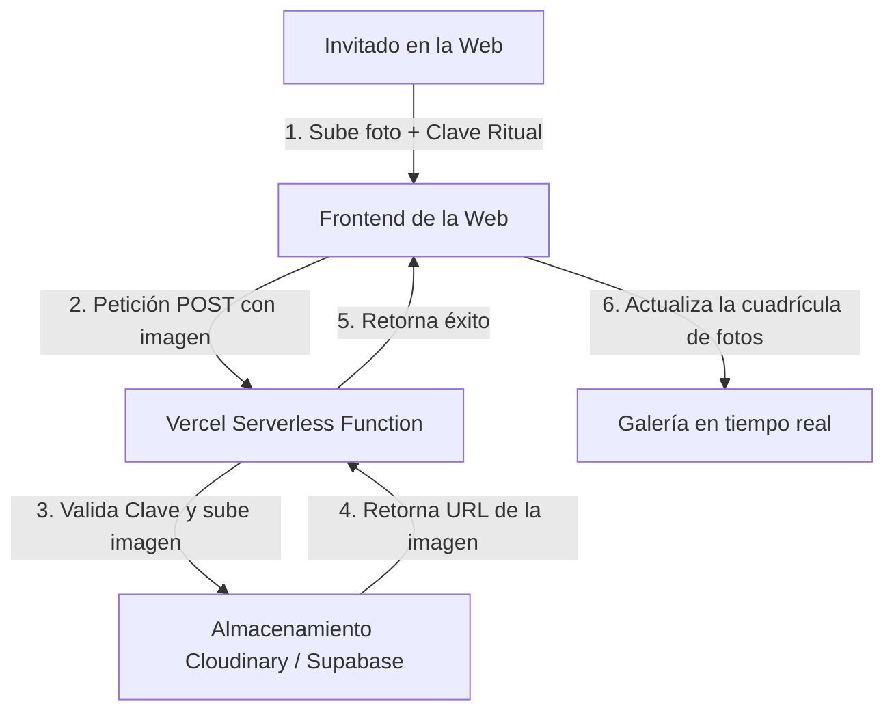

# Plan de Configuración de la Galería del Ritual

Este documento detalla la planificación y la arquitectura para la galería interactiva integrada en la Landing Page de la boda de Jeny & Víctor. 

## Solución Seleccionada: Opción 1 - Galería Integrada en Web
Para mantener la estética gótica/victoriana y evitar que los usuarios tengan que registrarse o iniciar sesión, utilizaremos una integración directa en la web que permita subir imágenes a un almacenamiento en la nube y mostrarlas dinámicamente en la sección **El Testigo**.

---

## Arquitectura del Sistema



---

## Tecnologías Propuestas

1. **Hosting del Proyecto:** [Vercel](https://vercel.com/) (Permite desplegar funciones backend Serverless sin coste).
2. **Servicio de Almacenamiento (Elegir uno):**
   * **Opción A (Recomendada): Cloudinary**
     * *Ventajas:* Excelente optimización automática de imágenes (redimensionado rápido para móviles, compresión inteligente). Plan gratuito generoso (25 GB o ~200,000 imágenes).
     * *Desventajas:* Panel de administración algo complejo, pero API muy sencilla.
   * **Opción B: Supabase Storage**
     * *Ventajas:* Base de datos Postgres integrada para guardar metadatos (nombre de quien sube la foto, fecha) y almacenamiento simple (1 GB gratuito).
     * *Desventajas:* Menor optimización de compresión al vuelo comparado con Cloudinary.

---

## Flujo del Invitado (Fricción Cero)

1. **Acceso:** El invitado accede a la sección **El Testigo** en su móvil.
2. **Subida:** 
   * Presiona el botón "Añadir recuerdo al archivo".
   * Opcionalmente introduce la **"Clave del Ritual"** (un mecanismo anti-spam simple, por ejemplo: `31102014` o `aquelarre`).
   * Selecciona una o varias fotos desde la cámara o galería del móvil.
3. **Procesamiento:** La imagen se sube en segundo plano. Aparece un spinner o barra de carga de estilo medieval/gótico.
4. **Visualización:** La foto se añade a la cuadrícula de la galería de inmediato para que todos los presentes puedan verla y descargarla a tamaño completo.

---

## Variables de Entorno Necesarias (Vercel)

Para evitar exponer las claves de subida en el frontend público de la web, configuraremos variables de entorno en Vercel:

```env
CLOUDINARY_CLOUD_NAME=tu_cloud_name
CLOUDINARY_API_KEY=tu_api_key
CLOUDINARY_API_SECRET=tu_api_secret
CLOUDINARY_UPLOAD_PRESET=galeria_boda_preset
CLAVE_RITUAL=aquelarre
```

---

## Fases de Implementación Futura

* [ ] **Fase 1: Preparación del Entorno**
  * Creación de cuenta gratuita en Cloudinary.
  * Configuración de un "Upload Preset" para organizar las fotos en una carpeta específica de la boda.
* [ ] **Fase 2: Desarrollo del Backend (Vercel Functions)**
  * Creación del endpoint `/api/upload` en Node.js para recibir la imagen, validar la clave de seguridad del ritual y realizar la subida segura a Cloudinary.
  * Creación del endpoint `/api/photos` para listar las fotos almacenadas y poder mostrarlas en el frontend.
* [ ] **Fase 3: Desarrollo del Frontend**
  * Creación del modal de subida de fotos (siguiendo el diseño del modal de música actual).
  * Sustitución de los placeholders estáticos del footer/galería por la cuadrícula dinámica que consuma `/api/photos`.
  * Implementación de un botón de descarga para cada imagen de la galería.
* [ ] **Fase 4: Despliegue y Pruebas**
  * Despliegue en Vercel y pruebas de subida móvil con red 4G/5G en tiempo real.
